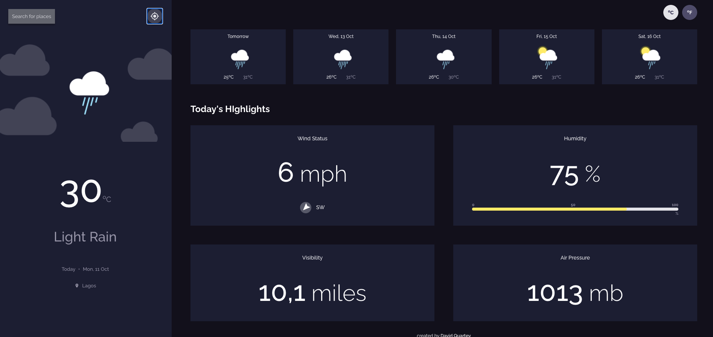

<!-- Please update value in the {}  -->

<h1 align="center">Weather App</h1>

<div align="center">
   Solution for a challenge from  <a href="https://investondaba.notion.site/daba-Front-End-Advanced-Test-1-e75b281f295e4457acac147d70312ee2" target="_blank">daba front end advanced coding exercise</a>.
</div>

<div align="center">
  <h3>
    <a href="https://practical-shaw-309fe4.netlify.app/">
      Demo
    </a>
    <span> | </span>
    <a href="https://github.com/DavidQuartz/weather-app">
      Solution
    </a>
    <span> | </span>
    <a href="https://investondaba.notion.site/daba-Front-End-Advanced-Test-1-e75b281f295e4457acac147d70312ee2">
      Exercise
    </a>
  </h3>
</div>

<!-- TABLE OF CONTENTS -->

## Table of Contents

- [Overview](#overview)
  - [Built With](#built-with)
- [Features](#features)
- [How to use](#how-to-use)
- [Contact](#contact)

<!-- OVERVIEW -->

## Overview



- Where can I see your demo?
  This project can be viewed at [https://practical-shaw-309fe4.netlify.app/](https://practical-shaw-309fe4.netlify.app/)

- What was your experience building it.
  I had fun building this project and I hope you have fun exploring it.

### Built With

- [React](https://reactjs.org/)
- [Tailwind](https://tailwindcss.com/)
- [Sass](https://sass-lang.com/)
- [Materia-UI](https://mui.com/)
- [ExpressJs](https://expressjs.com)
- [Axios](https://axios-http.com)

## Features

- Weather forecast for your city for up tp 5 days
- Geocoding
- Search for cities to view their weather forecasts
- Convert tempertatures from Celcius to Fahrenheit
- See min and max temperature each day
- See wind status and wind direction
- See humidity percentage
- See visibility indicator
- See air pressure number
- Request you current location weather

## How To Use

To clone and run this application, you'll need [Git](https://git-scm.com) and [Node.js](https://nodejs.org/en/download/) (which comes with [npm](http://npmjs.com)) installed on your computer. From your command line:

```bash
# Clone this repository
$ git clone https://github.com/DavidQuartz/weather-app

# Install dependencies
$ npm install

# Open 2 terminals
## Run the app in first terminal
$ npm run dev

## Run locaiton service in second terminal
$ npm run serve
```

## Contact

If you like this project, you can reach me at [quartzdavid@gmail.com](mailto:quartzdavid@gmail.com)
